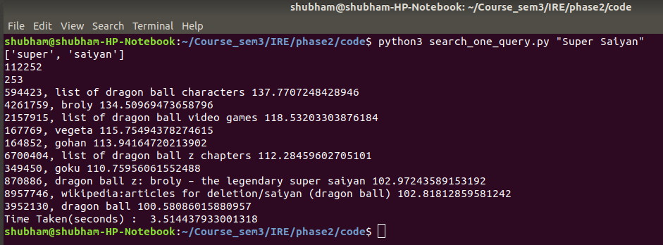

# Wiki Search Engine

Author : Shubham Agrawal
Roll no: 2019201085
Institute: IIIT-Hyderabad

 

# 1. Index Creation:
--------------------
1. __Indexing__ - Created posting list for each word in documents.
2. __Merging__ - While merging, done multi-level indexing and created secondary index for fast searching. 

Threshold for index creation is __26,000 documents__.

Threshold for merging and creating new file is __1,00,000 words__.

For Merging, heapq module of python is used.

There are 3 files for index creation:

	1. indexer.py
	2. merger.py
	3. title_mapper.py 

1. I have run it for 34 xmls around 42.6 GB wiki english dump.

2. Index_size = __11.1 GB__

3. Number of Index files = __132__

4. each inverted_index file contains around __1 lakh words__.

5. Number of tokens(words in index files) = __13125805__.

6. Total Number of documents = __9829059__

7. I have used my own doc ID scheme and created title_mappping.txt for mapping title to doc_id.

8. Created secondary index for title file as it was around 350 MB, __for fast document title retrieval (title_mapper.py)__.

# 2. Searching:
---------------
There are 2 files for Searching:

	1. search.py 
		- It takes queries.txt as 1st argument.
	2. search_one_query.py 
		- It takes query string as 1st argument.
		
# Queries type:

1. __Phrase Query:__
	Eg: cricket world cup
2. __Field Query:__ 
	Eg: t:World Cup i:2019 c:Cricket

# Method for searching:

1. In secondary index (named multi_level.txt) for fast searching, search the inverted index file number and I am using binary search on secondary index (named multi_level.txt) to speed up search.
 
2. Get the posting lists of the words related to query.

3. Take Intersection of Posting lists.

4. Rank them according to the __TF-IDF__ Score.

5. Display __Top K results__.
